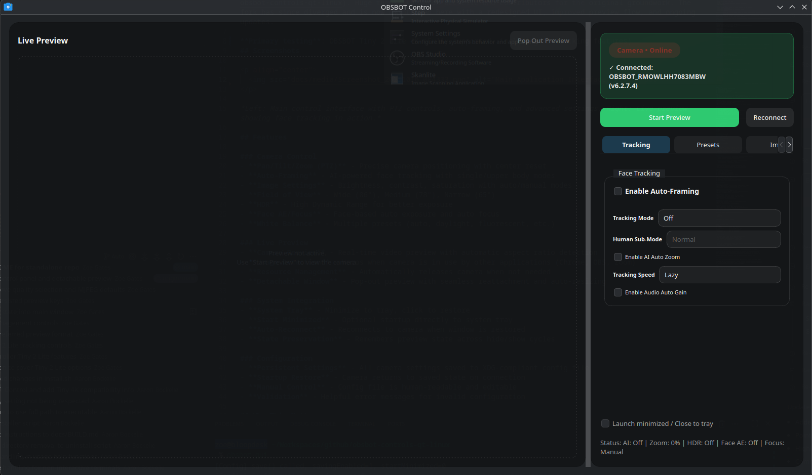

# OBSBOT Control for Linux

A native Qt6 application for controlling OBSBOT cameras on Linux. Provides full camera control with an intuitive GUI while allowing simultaneous use with streaming/conferencing software.

> **Acknowledgement**
> This project started life as a fork of [aaronsb/obsbot-controls-qt-linux](https://github.com/aaronsb/obsbot-controls-qt-linux). Huge thanks to Aaron Bockelie and contributors for the original groundwork. The fork has since diverged and is now maintained here with a redesigned UI, improved preview flow, and ongoing updates.

**Primary testing**: OBSBOT Tiny 2 Lite 4K (Fully supported, including AI tracking features)
## Screenshots

<p align="center">
  
</p>


## Features

### Camera Control
- **Pan/Tilt/Zoom (PTZ)** - Precise camera positioning with center reset
- **Auto-Framing** - AI-powered face tracking with single/upper body modes
- **Image Settings** - Brightness, contrast, saturation with auto/manual modes
- **Field of View** - Wide (86°), Medium (78°), Narrow (65°)
- **HDR** - High Dynamic Range for better exposure
- **Face AE/Focus** - Face-based auto exposure and auto focus
- **White Balance** - Multiple presets (auto, daylight, fluorescent, etc.)

### Live Preview
- **Camera Preview** - Real-time video preview with automatic aspect ratio detection
- **Usage Detection** - Warns when camera is in use by other applications (Chrome, OBS, Zoom)
- **Resource Management** - Automatically releases camera when not needed
- **Detachable Window** - Pop-out preview with seamless reattachment and auto-resizing

### System Integration
- **System Tray** - Minimize to tray, click to restore
- **Start Minimized** - Optional startup directly to system tray
- **Auto-Reconnect** - Reconnects to camera when window is restored
- **State Preservation** - Remembers preview state across hide/show cycles

### Configuration
- **Persistent Settings** - All camera settings saved to XDG-compliant config file
- **Startup Restore** - Camera returns to saved state on connection
- **Manual Control** - Config file is human-readable and editable
- **Validation** - Helpful error messages for invalid configuration

## Why This Matters

OBSBOT cameras have excellent Linux UVC support, but lack native control software. This application:

1. **Simultaneous Use** - Control camera settings while OBS streams video
2. **Resource Friendly** - Releases camera when minimized/hidden
3. **Native Performance** - Qt6 application, not Electron
4. **Standard Compliance** - Uses XDG config directories, system tray

### OBSBOT Tiny 2 Lite 4K ✅

- **Fully tested** - All features supported

### Other Models
Other OBSBOT cameras may work with varying degrees of functionality. The SDK supports multiple product types (Tiny, Tiny 2, Tail Air, Me, etc.), but testing is needed.

**Have another model?** Please [open an issue](https://github.com/bloopybae/obsbot-control-linux/issues) to report compatibility!

## Requirements

### System
- Linux (tested on Arch Linux with KDE Plasma)
- OBSBOT camera (USB connection - see [Compatibility](#compatibility))
- System tray support (KDE, GNOME, etc.)

### Build Dependencies
- Qt6 (Core, Widgets, Multimedia)
- CMake 3.16+
- C++17 compiler (GCC/Clang)
- OBSBOT SDK (included in `sdk/` directory)

### Runtime Dependencies
- Qt6 libraries
- V4L2 (Video4Linux2) support
- `lsof` for camera usage detection (optional but recommended)

## Quick Start

### One-Line Install

For the adventurous, a single command that clones the repo to `~/src/obsbot-control-linux` and builds/installs:

```bash
curl -fsSL https://raw.githubusercontent.com/bloopybae/obsbot-control-linux/main/install.sh | bash
```

⚠️ **What this does:**
- Clones repository to `~/src/obsbot-control-linux`
- Checks dependencies (shows what to install if missing)
- Builds and installs the application
- Adds desktop launcher to your app menu

### Standard Install

If you prefer to review the code first (recommended):

```bash
# Clone and build
git clone https://github.com/bloopybae/obsbot-control-linux.git
cd obsbot-controls-qt-linux
./build.sh install --confirm
```

The build script automatically:
- ✅ Checks dependencies (shows install commands for your distro)
- ✅ Builds the application
- ✅ Installs to `~/.local/bin`
- ✅ Adds desktop launcher to your app menu
- ✅ Offers to update your PATH if needed

**Common Commands:**
```bash
./build.sh build --confirm    # Build only
./build.sh install --confirm  # Build and install
./build.sh help              # Show all options
./uninstall.sh --confirm     # Remove installation
```

📖 **[Detailed Build Instructions →](docs/BUILD.md)** - Dependencies, manual build, troubleshooting

## Usage

### First Run
1. Connect your OBSBOT camera via USB
2. Launch application
3. Camera connects automatically
4. Adjust settings as desired
5. Settings auto-save to `~/.config/obsbot-control/settings.conf`

### Camera Preview
- Click **"Show Camera Preview"** to enable live preview
- If another app is using the camera, you'll see a warning with the process name
- Close the blocking application and try again

### System Tray
- Click **X** button to minimize to tray (doesn't quit)
- Click tray icon to show/hide window
- Right-click tray icon for menu
- Enable **"Start minimized to tray"** checkbox for startup behavior


## Configuration

Settings are stored in: `~/.config/obsbot-control/settings.conf`


### Manual Editing
- Boolean values: `enabled`/`disabled`, `true`/`false`, `yes`/`no`, `1`/`0`
- FOV values: `wide`/`medium`/`narrow` or `0`/`1`/`2`
- Zoom: `1.0` to `2.0`
- Pan/Tilt: `-1.0` to `1.0` (0 is center)
- Brightness/Contrast/Saturation: `0` to `255`

## Technical Details

### Architecture
- **Control Interface (SDK)** - USB control endpoint for camera settings
  - Can be used simultaneously by multiple applications
  - Always available when camera is connected

- **Video Stream (V4L2)** - `/dev/video*` device for preview
  - Exclusive access (one app at a time)
  - Preview optional - controls work without it

### Camera Detection
- Automatically finds OBSBOT camera in video device list
- Uses `lsof` to detect which process has video device open
- Filters out own process (control and preview can coexist)

### Resource Management
When window is hidden/minimized:
1. Preview state is saved
2. Preview is disabled if enabled
3. Camera SDK handle is released
4. Other applications can now access camera

When window is shown/restored:
1. Reconnects to camera control interface
2. Waits 1 second for stability
3. Attempts to restore preview if it was enabled
4. Shows warning if preview fails (camera in use)

## Troubleshooting

### Camera not detected
- Check USB connection: `lsof /dev/video0` (adjust device number)
- Verify udev permissions: User should be in `video` group
- Check kernel messages: `dmesg | grep -i video`

### Preview shows wrong camera
- Application auto-detects OBSBOT by name
- If multiple cameras, OBSBOT is selected by description match
- Fallback uses Qt6 Multimedia default camera

### Can't enable preview
- Orange warning shows which process is using camera
- Close blocking application (Chrome, OBS, Zoom, etc.)
- Click "Show Camera Preview" again
- Note: Controls work without preview!

### Settings not saving
- Check config directory exists: `~/.config/obsbot-control/`
- Verify write permissions
- Look for validation errors in config dialog

### System tray icon not showing
- Verify system tray support (KDE, GNOME extension, etc.)
- Check Qt6 platform plugin: `export QT_QPA_PLATFORMTHEME=qt6ct`
- Some minimal window managers lack system tray

## Project Structure

```
obsbot-controls-qt-linux/
├── src/
│   ├── gui/           # Qt6 GUI application
│   ├── cli/           # Command-line interface
│   └── common/        # Shared configuration code
├── sdk/               # OBSBOT SDK (proprietary)
├── resources/         # Icons and resources
└── CMakeLists.txt     # Build configuration
```

## Contributing

- Bug reports and feature requests: Open an issue
- Pull requests: Please discuss major changes first
- Code style: Follow existing Qt/C++ conventions


## License

This project is licensed under the MIT License - see the LICENSE file for details.

**Important:** The application code (src/) is MIT licensed, but it links against the
OBSBOT SDK (sdk/), which is proprietary software owned by OBSBOT. The SDK appears to
have been released without an explicit license and is likely intended for reference use.

Users of this software must comply with any applicable OBSBOT licensing terms.

## Disclaimer

This is an unofficial third-party application. Not affiliated with or endorsed by OBSBOT.

The OBSBOT SDK was likely released as a minimal reference implementation for Linux support.
This project extends that foundation into a full-featured graphical application, but makes
no warranty about compatibility or support from OBSBOT.

---
